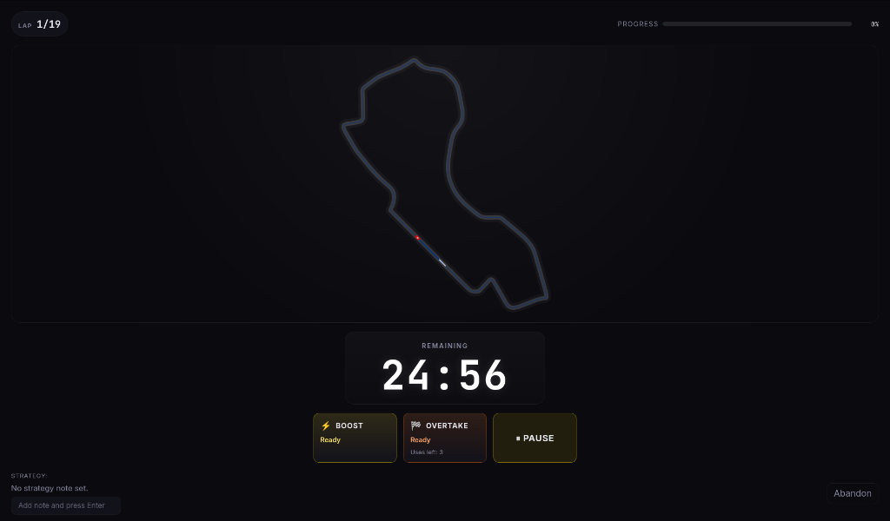

# Volante

<p align="center">
  
</p>

[](https://github.com/kleinebossie/volante-desktop/releases)
[](LICENSE)
[](https://github.com/kleinebossie/volante-desktop/actions)
[]()
[](https://github.com/kleinebossie/volante-desktop/stargazers)

**A desktop focus timer that uses Formula 1 race mechanics to make deep-work sessions engaging and hard to abandon.**

Pick a real F1 track. Start a race. A car drives around the circuit for the duration of your session. Use Boost and Overtake to speed up your timer — but if you pause, alt-tab, or go idle, the stewards will penalize you.

> 🔒 100% local. Zero cloud. Zero tracking. Your data never leaves your machine.



## ✨ Features

| Feature                         | Description                                                                            |
| ------------------------------- | -------------------------------------------------------------------------------------- |
| 🏁 **24 Real F1 Circuits**      | Every track on the 2026 calendar — Bahrain, Monaco, Silverstone, Spa, and more         |
| 🚗 **Live Track Visualization** | Your car physically drives around the accurate SVG map of the circuit                  |
| ⚡ **Race Regulations**         | Boost (2x pace), Overtake (2.5x pace), and DRS (1.5x pace) — with cooldowns and limits |
| 🚨 **Penalty System**           | Pausing, alt-tabbing, or going idle triggers steward penalties that cost you time      |
| 📝 **Strategy Notes**           | Write your focus plan with optional Parc Fermé lock                                    |
| 📊 **Session History**          | Every completed race is saved with full stats and penalty timeline                     |
| 🎨 **F1 Broadcast UI**          | Dark theme inspired by race control rooms — neon accents, smooth animations            |
| 🔒 **Local-First Privacy**      | All data stored locally. No accounts. No telemetry. No internet required.              |
| 📅 **Season Rulesets**          | Switch between 2025 regulations (DRS + Overtake) and 2026 (Boost + Overtake)           |

## 🖥️ Platform Support

| Platform                 | Status      | Notes                             |
| ------------------------ | ----------- | --------------------------------- |
| 🐧 Linux (Ubuntu 24.04+) | ✅ Tested   | Primary development platform      |
| 🍎 macOS (Apple Silicon) | ⚠️ Untested | CI-built, needs community testing |
| 🍎 macOS (Intel)         | ⚠️ Untested | CI-built, needs community testing |
| 🪟 Windows 10/11         | ⚠️ Untested | CI-built, needs community testing |

> 🧪 **Testers wanted!** If you're on macOS or Windows, please try the [latest release](https://github.com/kleinebossie/volante-desktop/releases) and [report your experience](https://github.com/kleinebossie/volante-desktop/issues/new?template=platform_report.md).

## 📥 Installation

Download the latest release for your platform from the [Releases page](https://github.com/kleinebossie/volante-desktop/releases/latest).

### Linux

**Debian/Ubuntu** (`.deb`):

```bash
sudo dpkg -i volante-desktop_*.deb
```

**Universal** (`.AppImage`):

```bash
chmod +x volante-desktop_*.AppImage
./volante-desktop_*.AppImage
```

### macOS

Download the `.dmg` file (choose `aarch64` for Apple Silicon or `x64` for Intel).

> The app is not notarized. You may need to right-click → "Open" on first launch, or run `xattr -c "/Applications/Volante.app"` in Terminal.

### Windows

Download and run the `.msi` installer.

> Windows may show a SmartScreen warning. Click "More info" → "Run anyway."

## 🚀 Development Setup

### Prerequisites

1. [Node.js](https://nodejs.org/) v20 or higher
2. [Rust](https://rustup.rs/) v1.70 or higher
3. Platform-specific dependencies — see [Tauri Prerequisites](https://v2.tauri.app/start/prerequisites/)

### Running Locally

```bash
git clone https://github.com/kleinebossie/volante-desktop.git
cd volante-desktop
npm install
npm run tauri dev
```

### Building for Production

```bash
npm run tauri build
```

Compiled binaries: `src-tauri/target/release/bundle/`

### Running Tests

```bash
npm run test
```

## 🤝 Contributing

Contributions are welcome! Whether it's bug reports, feature ideas, code, or documentation — every bit helps.

- 📖 Read the [Contributing Guide](CONTRIBUTING.md)
- 🐛 [Report a bug](https://github.com/kleinebossie/volante-desktop/issues/new?template=bug_report.md)
- ✨ [Request a feature](https://github.com/kleinebossie/volante-desktop/issues/new?template=feature_request.md)
- 💬 [Join the discussion](https://github.com/kleinebossie/volante-desktop/discussions)
- 🏷️ Check out [`good first issue`](https://github.com/kleinebossie/volante-desktop/labels/good%20first%20issue) for easy ways to get started

## 🙏 Credits

- **Track SVG data**: [julesr0y/f1-circuits-svg](https://github.com/julesr0y/f1-circuits-svg) by Jules Roy — licensed under [CC-BY-4.0](https://creativecommons.org/licenses/by/4.0/)
- **Built with**: [Tauri v2](https://v2.tauri.app/) · [React 19](https://react.dev/) · [TypeScript](https://www.typescriptlang.org/) · [Zustand](https://zustand.docs.pmnd.rs/) · [Framer Motion](https://motion.dev/) · [Vite](https://vite.dev/)

## 📄 License

MIT License — see [LICENSE](LICENSE) for details.

---

_Disclaimer: This app is not affiliated with, endorsed by, or sponsored by Formula One World Championship Limited or any of its affiliates. "F1" and "FORMULA 1" are trademarks of Formula One Licensing BV._
